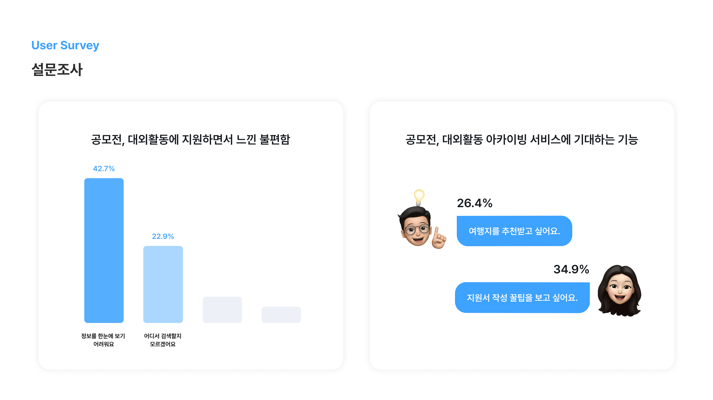

# 🌟 서비스명

 

청유문인 ”여행 갈래?”와 감탄문인 “여행 갈래!”를 중의적으로 표현하고자 했습니다.

여행 프로그램들을 통해 던지는 저희의 제안이자, 여행을 가고자 결심하는 여행객의 마음을 나타냅니다.

동시에 평소 생각하지 못했던 여러 '갈래'의 여행길을 발견하게 되고, 색다른 경험의 시작점이 된다는 것을 의미합니다.

   

## 🕊️ 팀명

### 트래블메이커 (TravelMaker)

'색다르고 다양한 방법의 여행을 만드는 사람들'이라는 뜻을 담았습니다.

   

## :heart: R&R

| 분야 | 이름 | 포지션 |
| --- | --- | --- |
| 기획   | 김다연   | 📈 서비스 기획 - 전반적인 서비스 기획, 서비스 정책 확립, 플로우차트 작성|
| 기획   | 김민아  | 📋 프로젝트 매니징, 서비스 기획 - 전반적인 서비스 기획, 서비스 정책 확립, 서비스 컨셉 구체화 |
| 기획   | 이상민   | 📊 서비스 기획 - 전반적인 서비스 기획, 서비스 정책 확립, 유저 리서치 분석|
| 디자인 | 김그린   | 🎨 서비스 디자인                          |
| 개발   | 안재국 | 🖌️ 프론트엔드 리드, 웹 화면 UI 구현, 서버 연동             |
| 개발   | 안민하 | 🖌️ 웹 화면 UI 구현, 서버 연동                              |
| 개발   | 김명현 | 💻 백엔드 리드, DB 및 API 구축, 서버 배포                  |
| 개발   | 나세빈   | 💻 DB 및 API 구축, 서버 배포                               |

   

## 🔎 목적 및 필요성

### 1️⃣ 목적
    
> 1) 여러 여행 지원사업과 대외활동, 공모전을 한 눈에 보기 쉽게 아카이빙하는 사이트를 제작합니다. 
>    
> 2) 이를 통해 잘 알려지지 않은 여행지를 홍보하여 지역 경제 활성화와 지역 관광의 다양화를 기대합니다.
    
 

### 2️⃣ 필요성

#### 0. 정의 

1) 여행 지원사업: 지자체, 공공기관 등에서 지역 관광 활성화를 위해 국민에게 숙박비, 체험비, 여행보험료, 휴가비 등을 지원하는 사업 

2) 여행 공모전: 지자체, 공공기관 등에서 지역 관광 상품 개발, 지역 관광 홍보를 위해 특정 주제에 대하여 아이디어, 작품 등을 공개 모집하는 사업 
   
3) 여행 대외활동: 지자체, 공공기관 등에서 지역 관광 홍보를 위해 특정 주제에 대하여 일정 기간동안 콘텐츠 제작, 기사 발행, 교육 등의 활동을 지원하는 사업

 

#### 1. 인구 감소에 대응하고 지역 경제를 활성화하기 위한 방안으로의 관광 산업 
관광 산업을 통해 지역 인구 감소에 대응하고 지역 경제를 활성화를 도모하는 사례가 증가하고 있습니다.

다음은 <한국관광 데이터랩>의 인구감소지역 현황 지도입니다. 

수도권과 제주권을 포함한 일부 지역을 제외하고, 대부분의 지방에서 인구 감소 현상이 나타나고 있다는 것을 알 수 있습니다. 

인구 감소 현상은 자연스럽게 지역 내 소비 감소로 이어지며, 이는 지역 경제 침체를 불러일으킵니다. 

<한국관광 데이터랩>의 조사 결과, 경상남도 함안군의 경우 인구 감소로 인해 소실되는 지역 소비액을 외부인 소비액으로 대체하기 위해서는 숙박 관광객 32명 또는 당일 관광객 81명 등이 필요합니다. 

 

#### 2. 여행 지원사업 및 공모전/대외활동 프로그램의 필요성 
여행 지원사업과 공모전/대외활동 프로그램은 지속 가능한 관광과 지역 균형 발전을 위해 추진되고 있습니다. 

여행 지원사업을 통해 지자체는 관광 소비와 홍보 효과를 기대할 수 있습니다. 

실제로 문화체육관광부와 한국관광공사는 지역만의 독특한 생활양식과 스토리를 발굴하여 지역관광 활성화를 도모하기 위해 2019년부터 ‘생활관광 활성화 사업’을 추진하고 있으며, 

2022년에는 현지 살아보기형 프로그램을 진행할 총 9개 지자체를 선정하여 각각 국비 1억 원씩을 지원하였습니다. (출처: 한국관광공사, '2022 생활관광 활성화 방안 연구용역 결과보고서')

이 밖에도 많은 형태의 지원사업이 진행 중에 있으며, 같은 맥락으로 여행 상품 개발과 홍보 효과를 가져다줄 수 있는 대외활동과 공모전 또한 활발히 시행되고 있습니다.  

이러한 여행 지원사업, 여행 대외활동과 공모전을 통해 숙박비 체험비 등을 지원받아 여행할 수 있다는 점에서 대중의 관심도도 높습니다. 

실제로 한국관광공사에서 시행 중인 근로자 휴가지원사업의 경우 1:5의 경쟁률로 약 2만 명이 신청하였고, 2023년 경남형 한달살기 여행 지원사업은 총 3차까지 진행된 바 있습니다. 

 
    
#### 3. 여행가들과 관광 지역의 상호 이익을 연결할 플랫폼의 필요성 

현재 여행 지원사업, 여행 대외활동, 여행 공모전 등의 프로그램의 진행 방식은 다음과 같습니다. 

##### 지자체, 기관 홈페이지에 게시 → 지자체 인스타그램, 블로그 및 민간 크리에이터의 홍보 → 홍보물을 통한 지원자의 프로그램 인식 → 프로그램 지원 

따라서 여행 프로그램에 관심이 많은 예비 지원자들이 이곳 저곳에 흩어져 있는 정보를 수집하는 과정에서 많은 리소스를 들이고 있으며, 

홍보하는 지자체와 기관 또한 마케팅 비용을 지불하고 있으나 정보가 산재한 탓에 효율성이 낮습니다. 

따라서 저희는 여행 지원사업, 여행 공모전, 여행 대외활동을 한 곳에 모아 공급자와 수요자를 연결하는 아카이빙 플랫폼을 기획하고자 합니다.  

   

## 📊 리서치 및 시장조사

### 1️⃣ 유저리서치 분석 

#### 1. 여행 지원사업, 공모전, 대외활동 경험이 있는 연령대와 직업은 무엇일까?

> 연령대 | (1위) 20대 41.5%, (2위) 30대 31.4%

> 직업 | (1위) 회사원 52.5%, (2위) 대학생 18.9%

조사 결과, 여행 프로그램에 지원해본 경험이 있는 159명 중 주 연령대는 2030 세대, 직업은 회사원과 대학생인 것으로 나타났습니다. 

따라서, '갈래'의 주요 사용자 타겟을 2030 세대로 선정했습니다. 

이에 맞추어 웹페이지의 디자인을 #밝은 #생동감있는 #귀여운 #도전적인 무드로 결정했습니다. 

 

#### 2. 여행 지원사업에 참여하게 된 동기는 무엇일까?

> 1위 | 지원금으로 여행 경비를 절약하기 위하여, 65.9%
>
> 2위 | 지원사업에 흥미를 느끼게 되어서, 25%

조사 결과, 대부분의 지원자가 '여행 경비 절감'을 목적으로 여행 지원사업에 참여하였음을 알 수 있었습니다. 

따라서, '갈래'의 주요 사용자 타겟을 '여행 경비 절감에 관심 있는 2030 세대'로 집중하였습니다. 

더하여, 활발한 홍보를 통해 '흥미나 관심을 느껴서' 여행 지원사업을 고려하고 있는 사람들도 서비스에 유입시키는 것이 '갈래'의 목표입니다. 

 

#### 3. 여행 지원사업에 참여하면서 가장 불편한 점은 무엇이었고, 아카이빙 서비스에서 가장 기대하는 것은 무엇일까?

불편함
> 1위 | 정보를 한 눈에 보기 어렵다, 40.9%
> 
> 2위 | 후기 정보가 부족하다, 26.5%

기대 사항
> 1위 | 지원서, 보고서 작성 꿀팁을 보고 싶다, 45.8%
> 
> 2위 | 여행지를 추천받고 싶다, 22.9%

 

#### 4. 여행 공모전, 대외활동에 참여하면서 가장 불편한 점은 무엇이었고, 아카이빙 서비스에서 가장 기대하는 것은 무엇일까?

불편함
> 1위 | 정보를 한눈에 보기 어렵다, 42.7%
> 
> 2위 | 어디에서 검색할지 모르겠다, 22.9%

기대 사항
> 1위 | 지원서, 보고서 작성 꿀팁을 보고 싶다, 34.9%
> 
> 2위 | 여행지를 추천받고 싶다, 26.4%

 

불편 사항과 기대 사항에 대한 의견을 고려하여, '갈래'의 메인 기능을 다음과 같이 선정하였습니다. 

> 1. 한 눈에 여행 프로그램을 모아 보고, 검색하고, 필터링할 수 있는 아카이빙 & 검색 서비스
>    
> 2. 과거 프로그램에 대한 지난 지원자들의 후기 게시판과 지원서, 홍보물, 결과물들을 볼 수 있는 자료실 게시판
>    
> 3. 지원서 작성, 경비 절감에 대한 일반적인 꿀팁을 볼 수 있는 게시판
>    
> 4. 프로그램 대상 지역에서의 여행지 추천 기능 (추후 확장 서비스)

 

#### 5. 여행 프로그램 경험이 있는 사람들은 '갈래' 서비스를 얼마나 이용하고 싶을까?

조사 결과, 많은 수의 사람들이 '갈래' 서비스를 사용할 의향이 있다는 것을 확인할 수 있었습니다.

 

### 2️⃣ 목표 시장

| TAM      | SAM      | SOM     |
| -------- | -------- | ------- |
|대한민국 국민 중 국내여행 경험이 있는 사람 | 국내여행 경험이 있는 2030세대 | 국내여행 경험이 있는 2030세대 중 여행지원사업에 관심이 있는 사람|
|4782만 명 | 1227만 명 | 1만명|

> TAM: 대한민국 국민 중 국내여행 경험이 있는 사람을 유효시장으로 잡고자 합니다.
>
> (대한민국 총 인구수 5155만명 * 국내여행 경험률 94.2% = 4782만명, 통계청 2019년 자료 기준)

 

> SAM: 국내여행 경험이 있는 사람들 중 여행 경비에 민감한 2030세대를 수익시장으로 잡고자 합니다.
>
> (20대 인구수 662만명 * 20대 국내여행 경험률 91.1% + 30대 인구수 689만명 * 30대 국내여행 경험률 90.6% = 1227만명, 통계청 2019년 자료 기준)

 
    
> SOM: 유효 시장 중 여행지원사업에 관심이 있는 사람을 수익시장으로 잡고자 합니다. 
>
> (휴가비 지원사업 지원자 5818명 / 경기도 경제활동인구 700만명 * 1227만명 = 1만명, 경기도 노동자 휴가비 지원사업 경쟁률 참고)

   

## 👀 서비스 타겟층 정의

갈래의 타겟 유저는 크게 Consumer와 Business로 나눌 수 있습니다. 

### 1️⃣ Consumer

갈래의 개인 유저는 다음과 두 가지와 같습니다. 

 

**1. 2030 세대 중, 여행 경비 절약을 원하는 사람**

| 분류      | 1차 타겟 유저 | 2차 타겟 유저 | 
| --------- | ------------- | ------------- |
| 타겟 설정 |  2030 세대   |  여행 경비 절약을 원하는 사람  |
| 관련 기능 |  여행 프로그램 검색  |  여행 지원사업 및 후기 검색    |

유저 리서치 결과, 여행지원사업을 경험한 응답자들 중 대부분은 지원 목적으로 "여행 경비를 절약"을 꼽았습니다.

 

따라서 갈래의 첫 번째 타겟 유저는 여행 경비를 절약할 동기를 갖고 여행지원사업을 신청할만한 청년층입니다.

(장년층 이상은 상대적으로 경제적 여유가 있으며 여행지원사업 진행 과정을 번거로워할 것으로 판단했습니다.) 

 

**2. 청년 중, 관광 산업 취ꞏ창업 희망자**

| 분류      | 1차 타겟 유저 | 2차 타겟 유저 |
| --------- | ------------- | ------------- |
| 타겟 설정 |  2030 세대  |  관광 산업 취ꞏ창업 희망자  |
| 관련 기능 |  여행 프로그램 검색  |  여행 대외활동, 공모전 검색 및 스크랩  |

여행 프로그램을 대중에게 쉽게 홍보하여 지역 관광 활성화를 도모하는 '갈래' 서비스의 취지에 부합하기 때문에, 
여행 대외활동과 공모전도 서비스 대상에 포함시켰습니다. 

 

여행 대외활동과 공모전에 참여할 동기가 있는 사람들 중 관광 산업 취ꞏ창업 희망자가 많기 때문에 타겟 유저를 이와 같이 선정하였습니다.

 

### 2️⃣ Business

갈래의 기관/기업 유저는 다음과 같습니다.

 

**여행 지원사업, 공모전, 대외활동을 주최하는 기관**

| 분류      | 1차 타겟 유저 | 2차 타겟 유저 |
| --------- | ------------- | ------------- |
| 타겟 설정 |  관광 산업 기관  |  정부부처, 지자체, 공기업  |
| 관련 기능 |  여행 프로그램 업로드  | 조회수, 스크랩수 대시보드  |

기존 여행 프로그램을 각 기관의 홈페이지, 블로그, 인스타그램 등 sns에 홍보하고 있다는 사실에 미루어 보아, 

진행 중인 여행 프로그램을 홍보하고자 하는 니즈가 있으며 마케팅 비용이 발생하고 있다는 사실을 알 수 있습니다. 

 

따라서 여행 프로그램을 기획할만한 관광 산업 기관, 그 중에서도 다수를 차지하는 정부 부처, 지자체, 공기업을 타겟 유저로 선정하였습니다.

   

## 📋 경쟁사 분석 
기존에 '여행 지원사업/대외활동/공모전 아카이빙 플랫폼'이 존재하지 않아, 비슷한 맥락의 웹사이트 3곳을 분석하였습니다.
| 경쟁사 분석 | 🗺️갈래 | 1️⃣ 링커리어 | 2️⃣ 관광인 | 3️⃣ 한국관광산업포털(투어라즈) |
|  ----- |----- | ----- | ----- | ----- |
| 서비스 분야 | 여행 프로그램 아카이빙 플랫폼	| 대외활동/공모전/동아리/인턴 정보 아카이빙 플랫폼	| 한국관광공사 관광전문인력포털	| 한국관광공사 관광산업 포털|
| 서비스 한줄 소개 | 여행 지원사업, 대외활동, 공모전 아카이빙 플랫폼	| 대외활동, 공모전, 인턴, 대기업 채용정보	| 관광전문인력 양성 지원 포털	| 관광산업에 필요한 모든 지원과 정보를 통합 제공|
| 메인 기능 | 여행 지원사업, 대외활동, 공모전 검색 및 탐색	| 대외활동/공모전/동아리/인턴 정보 탐색 및 개인 맞춤형 추천	| 일자리정보, 취업컨설팅, 자격증발급 등 정보 제공	| 정책지원, 관광산업 종사자 대상 서비스 등의 정보 검색 및 탐색 |
| 서브 기능	| 여행 프로그램 후기, 자료실 열람	커뮤니티를 통한 소통, 지원후기 열람	| 취업컨설팅 진행, 교육안내	| 워크스페이스 제공, 관광브리프, 관광산업 종사자 간의 네트워크 형성 |워크스페이스 제공, 관광브리프, 관광산업 종사자 간의 네트워크 형성|
|여행 지원사업 탐색 방법	| 검색어 검색, 필터링 검색, 지도 내에서 탐색	| 없음	| 없음	| 정책브리핑 메뉴 속게시판으로 ‘생활관광 활성화’, ‘2023 디지털관광주민증 사업’|
|여행 대외활동, 공모전 탐색 방법	| 검색어 검색, 필터링 검색, 지도 내에서 탐색	| 필터링 검색, 검색어 검색	| 알림마당>새소식에 공지사항 형태로 정보 제공	| 없음|
|여행지 추천 기능	|추후 확장 서비스에 포함될 기능, 상세 페이지 하단에 여행 프로그램 관련 여행지 추천 	|없음	|없음	|없음|
|한계점(갈래의 차별성)	|‘여행’을 메인 주제로 하여 여행과 관련된 지원사업, 대외활동, 공모전을 한 눈에 볼 수 있음	| 대학생의 스펙을 위한 활동이 메인, 즉 ‘여행'이 메인이 아님	| 관광인력 양성이 메인이고, ‘여행 프로그램’이 메인이 아님, 필터링이 불가능해서 검색이 불편함	| 여행객이 메인 타겟층이 아님(관광 산업 종사자를 대상으로 하는 서비스), 각 지원사업에 대한 정보 접근 불가능|

   

## 💡 서비스 소개

### **1️⃣ 개요**
‘갈래’는 여러 기관 또는 기업에서 진행하는 여행 지원사업, 대외활동, 공모전을 아카이빙하는 웹사이트입니다.

지도 위에 여행 지원사업을 표시하여 지역별 지원사업을 한눈에 파악할 수 있도록 합니다.

검색 필터 기능을 통해 지역, 프로그램, 세부 카테고리 등 다양한 조건에 맞춰 검색할 수 있으며, 
마감기한을 표시하여 사용자들이 기한을 놓치지 않도록 합니다.

게시판 기능을 통해 여행 프로그램에 참여한 후기 및 합격 수기를 열람할 수 있습니다.

 

### 2️⃣ 핵심 기능
**1. 핵심 기능:** 
여행 프로그램(여행 지원사업, 대외활동, 공모전) 검색 및 탐색

**2. 세부 기능:**

    1. 필터링을 통한 검색: 지역, 프로그램, 카테고리, 모집 기간 등을 필터링하여 세부적인 검색 가능
    
    2. 지도 제공: 지도 위에 여행 프로그램을 표시하여 지역별 여행 프로그램 한 눈에 확인 가능
    
    3. 지원 후기: 게시판 형식으로 여행 프로그램에 대한 후기를 작성 및 열람 가능
    
    4. 자료실: 실제로 여행 프로그램에 참여했던 사람들의 지원서, 보고서 예시자료를 열람할 수 있고, 본인이 직접 업로드도 가능. <지원 후기>와 마찬가지로 게시판 형태
    
    5. 찜 기능: 관심있는 여행 프로그램을 찜 기능을 통해 한 데 모아 볼 수 있음
    
### FLOWCHART

### IA

   

## 📊 서비스 비즈니스 모델

### **홍보 뉴스레터 발송 서비스**

    - 홍보 뉴스레터 발송을 대행하는 B2B 서비스입니다. 
    
    - 새로운 여행 프로그램을 업로드했거나, 기타 홍보하고 싶은 사항이 있는 기관/ 기업 유저에게 홍보 뉴스레터 발송 요청을 받습니다. 
    
    - 새로운 여행 프로그램이나 기타 홍보사항에 관한 뉴스레터를 '트래블메이커' 팀원들이 기획, 작성합니다. 

    - '갈래'의 회원 중 마케팅 수신 동의를 한 회원들에게 뉴스레터를 발송합니다. 

    - 뉴스레터 발송 건수에 따라 수익이 발생합니다. 

    - 뉴스레터 발송 수단은 메일 또는 오픈채팅방을 고려 중입니다. 
    

  

## **🎨 디자인 무드보드**

  

## **🔍 System Architecture**

  

## **💻 Technology**

- ## Web Front
       

- ## Server
           

- ## Co-working Tool
    

  

### **🐾 기술 스택 선정 이유**

### **📘 Web Front 스택 선정 이유**

- 빠른 렌더링과 코드 재사용성
  - 컴포넌트 기반의 아키텍처와 가상 DOM을 통해 빠른 렌더링을 제공
  - 성능 최적화와 코드 재사용성을 극대화
- 동적인 웹 어플리케이션 구현을 위한 상태 관리
  - 가상돔을 통해 렌더링을 최적화
- 인기있는 라이브러리
  - 리액트는 사용량이 많은 만큼 다양한 문제에 대한 솔루션과 지원을 얻을 수 있기에 선정
  - 다양한 기능 구현에 도움이 될 것이라 예상

- 코드 안정화
  - JavaScript에 정적 타입 시스템을 도입하여 코드의 안정성과 가독성을 향상
  - 오류 예방이 가능하며 프로젝트에서 팀 협업과 유지보수를 더 효과적으로 만들어준다는 점에서 TypeScript로 선정

- 빠른 개발 및 빌드 속도
  - 빠른 개발 속도를 제공하는 현대적인 빌드 도구로서, Hot Module Replacement를 지원하여 개발 과정을 더 효율적으로 만들어준다는 장점

- 상태 관리의 편리함
  - 컴포넌트 상태를 효율적이고 편리하게 사용할 수 있도록 하기 위함

- 컴포넌트 스타일
  - 컴포넌트 수준에서 스타일링을 관리하는 효과적인 방법 제공
  - 스타일과 컴포넌트를 관리 및 유지보수할 때 생기는 복잡성 감소
  - 스타일 컴포넌트 재사용 가능

- 데이터 캐싱
  - React query를 사용하여 데이터 요청과 캐싱을 간편화하여 프로그램 성능 향상에 도움

  

### **📗 Server 스택 선정 이유**

- 다양한 라이브러리와 설정을 자동으로 제공하므로 개발자가 애플리케이션을 더 빠르게 만들 수 있습니다.
- 특정 환경이나 서버, 기술에 종속되지 않으며 유연한 애플리케이션을 개발할 수 있습니다.

- key, value 형태로 데이터 저장 및 해당 데이터의 유효기간 설정을 통한 토큰 관리 용이하므로 유효시간이 필요로 되는 로직에서의 성능 이점을 확보하기 위해 사용했습니다.

- 데이터베이스 쿼리를 간단하게 작성할 수 있어 쿼리 작성에 필요한 노력과 시간을 크게 줄일 수 있습니다.
- ORM(Object-Relational Mapping) 기능을 자동으로 제공하므로 객체와 데이터베이스 간의 매핑을 자동으로 처리할 수 있으며, 데이터베이스의 스키마 변경에도 유연하게 대응할 수 있습니다.

- 인증과 권한 부여를 처리하는 기능을 제공 및 역할 부여 , 이를 통해 애플리케이션에서 안전한 인증 및 권한 부여 프로세스를 구현할 수 있습니다.

- 사용자 인증에 필요한 모든 정보는 토큰 자체에 포함하기 때문에 별도의 인증 저장소가 필요 없습니다.
- 쿠키를 전달하지 않아도 되므로 쿠키를 사용함으로써 발생하는 취약점이 사라집니다.

- 다양한 운영 체제에서 실행될 수 있습니다.
- 인덱스, 캐싱, 쿼리 최적화 등의 기술을 사용하여 높은 처리 속도와 성능을 제공합니다.

- **새로운 변경사항이 포함된 어플리케이션을 위한 새로운 환경을 구축하고 교체하는 방법**
    - 버전 관리 문제를 방지
    - 운영 환경에 영향을 주지 않고 실제 서비스 환경으로 새 버전 테스트가 가능

- **트래픽이 많은 웹사이트의 서버(WAS)를 도와주는 비동기 이벤트 기반구조의 경량화 웹 서버 프로그램**
    - 이벤트 중심 접근 방식을 사용하여 클라이언트 요청 제공
    - 제한된 하드웨어 리소스로도 여러 클라이언트 요청을 동시에 효율적으로 처리
    - 단일 스레드를 통해 여러 연결을 처리 가능
    - 최소한의 리소스로 웹 서버의 아키텍처를 개선하기 위해 독립형 HTTP 서버로 배치 가능

- **CI(Continuous Integration, 지속 통합)와 CD(Continuous Deployment, 지속 배포)를 위한 비교적 최근에 추가된 서비스**

- **애플리케이션을 신속하게 구축, 테스트 및 배포할 수 있는 소프트웨어 플랫폼**
    - Docker는 소프트웨어를 컨테이너라는 표준화된 유닛으로 패키징하며, 이 컨테이너에는 라이브러리, 시스템 도구, 코드, 런타임 등 소프트웨어를 실행하는 데 필요한 모든 것이 포함되어 있음
    - Docker Hub는 Docker에서 운영하는 기본이자 공식 이미지 저장소

- **단일 서버에서 여러개의 컨테이너를 하나의 서비스로 정의해 컨테이너의 묶음으로 관리할 수 있는 작업 환경을 제공하는 관리 도구**

- **아마존 웹 서비스(AWS)에서 제공하는 클라우드 컴퓨팅 서비스**
- 클라우드 컴퓨팅은 인터넷(클라우드)을 통해 서버, 스토리지, 데이터베이스 등의 컴퓨팅 서비스를 제공 → **AWS에서 원격으로 제어할 수 있는 가상의 컴퓨터를 한 대 빌리는 것**

- Amazon Relational Database Service(***RDS***)는 클라우드에서 간편하게 데이터베이스를 설치, 운영 및 확장할 수 있는 관리형 서비스 모음

  

## **🔖 Naming Rules**

### **Frontend**

- 기본적으로 Camel Case 규칙을 따른다.
  - non-components 명칭
  - 변수, 메소드 명칭
- 예외
  - components 명칭 : Pascal Case
  - type 명칭 : Pascal Case
  - 상수 : 대문자 + Snake Case
       

### **Backend**
- 기본적으로 Camel Case 규칙을 따른다.
  - 폴더명 같은 경우는 lowcase로 작성
  - 클래스명은 Pascal Case로 작성

## **🗂️ Commit Convention**

- 형식: `태그: 커밋내용`
- 이슈 번호는 붙이지 않기
- 영어와 한글로 알아보기 쉽게 작성하기

 

### **📌 Type**

| 태그 이름 | 설명                                                          |
| :-------: | :------------------------------------------------------------ |
|   feat    | 새로운 기능 구현                                              |
|    fix    | 버그, 오류 해결                                               |
|   docs    | README나 WIKI 등의 문서 수정                                  |
|   style   | 기능 수정이 없는 스타일 변경                                   |
| refactor  | 코드 리팩토링                                                 |
|   test    | 테스트 코드, 리펙토링 테스트 코드 추가                        |
|   chore   | 빌드 업무 수정, 패키지 매니저 수정, 간단한 코드 수정, 내부 파일 수정 |

 

## **🐬 Git Flow**

| 브랜치 명 | 설명 |
| :-------: | :--------------------------------------------------------------------------------- |
| main | 소프트웨어 제품 배포하는 용도로 쓰는 브랜치 |
| develop | 개발용 default 브랜치로, 이 브랜치를 기준으로 feature 브랜치를 따고, 합치는 브랜치 |
| feat | 단위 기능 개발용 브랜치 |
| fix | 단위 기능 개발 수정용 브랜치 |
| hotfix | master에 배포 코드가 합쳐진 후 버그 발생 시 긴급 수정하는 브랜치 |

### **📌 Branch**

- 깃플로우에 따라 기능별로 브랜치 생성
- 형식: `헤더/#이슈번호/기능명`

 
